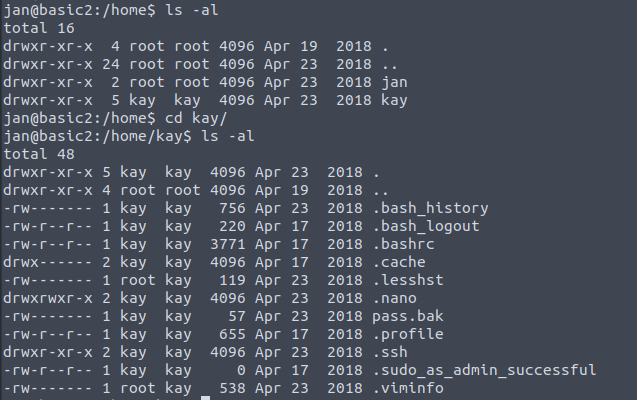
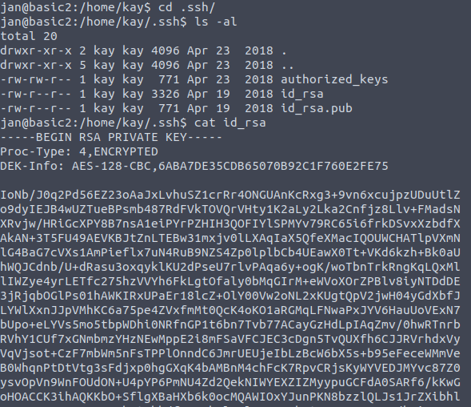
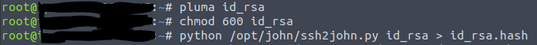
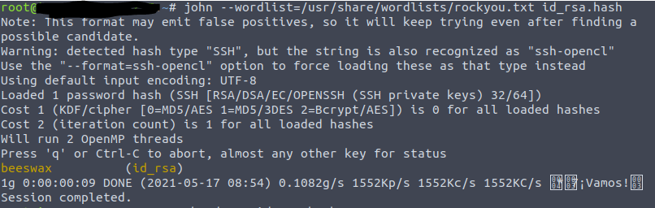
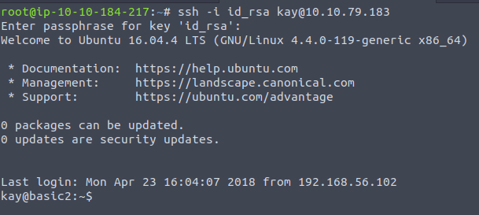

# Basic Pentesting
This CTF contains:
    * brute forcing 
    * hash cracking 
    * service enumeration
    * Linux Enumeration

Starting with a Nmap Scan: 
 

There are several findings. First the Apache Webserver, second the SMB service, and SSH is enabled.  

The next Scan will be against the Webserver with gobuster to find hidden directories. 
  

Running at the same Time enum4Linux to get Information on the SMB protocol. 
 
The Scan gave two results. Those results are going to be used in a bruteforce attack against ssh with hydra. 
The first username came back with no results, but for the second username hydra found credentials. 
 
Log into ssh with the credentials and search trough the Files. 
 
There is a Folder for the second User 'Kay'. That Folder contains a Password Backup File, and the ssh directory with the private ssh key for Kay.  
 
Open and copy it. Then convert it into a hash File so that John the Ripper can crack it. 
 
Now it can be cracked with John 
 
With the given Password we can log in as Kay.  
 
Now the Password File can be accessed. 
