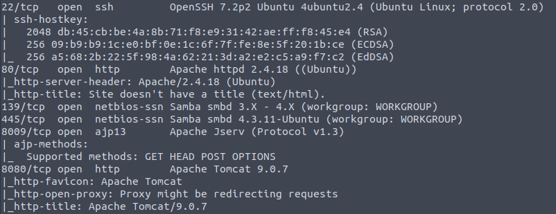
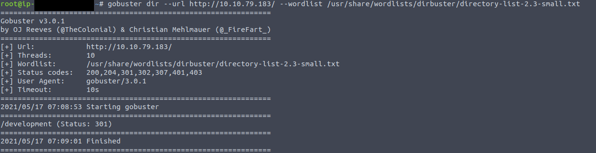
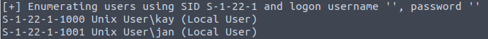
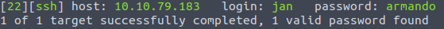

# Basic Pentesting
This CTF contains:
    * brute forcing 
    * hash cracking 
    * service enumeration
    * Linux Enumeration

Starting with a Nmap Scan: 
 

There are several findings. First the Apache Webserver, second the SMB service, and SSH is enabled.  

The next Scan will be against the Webserver with gobuster to find hidden directories. 
  

Running at the same Time enum4Linux to get Information on the SMB protocol. 
 
The Scan gave two results. Those results are going to be used in a bruteforce attack against ssh with hydra. 
The first username came back with no results, but for the second username hydra found credentials. 
 

