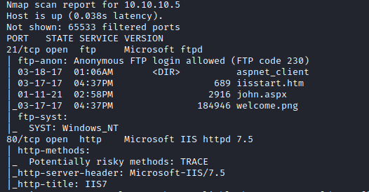
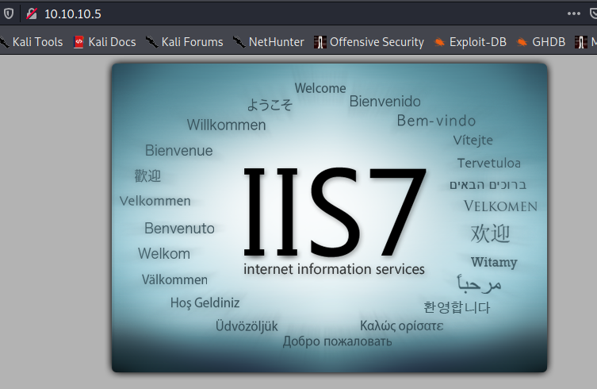
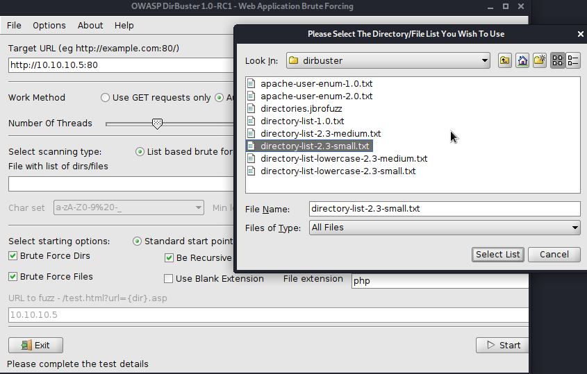
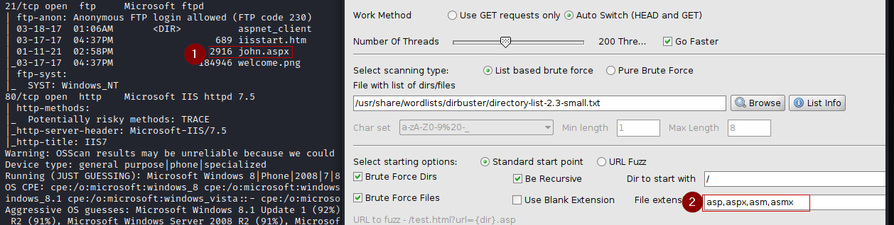

###Devel Machine on 10.10.10.5

Way to go is to check for extra directories with dirbuster. 
The Scan came back with a open Port 21 and open Port 80. Ftp with anonymous login allowed is running on 21. 
Seems to be a default webpage. Could be hinting to a hidden directory. 
 
  
####Dirbuster configuration
 
First, enter the address of the webpage. Then give a list of directories. There are ready-made lists under the path /usr/share/wordlists/dirbuster.  
Next, specify the file extensions to be searched for. Because an aspx file popped up during the scan, these extensions are probably a good guess. 
 

