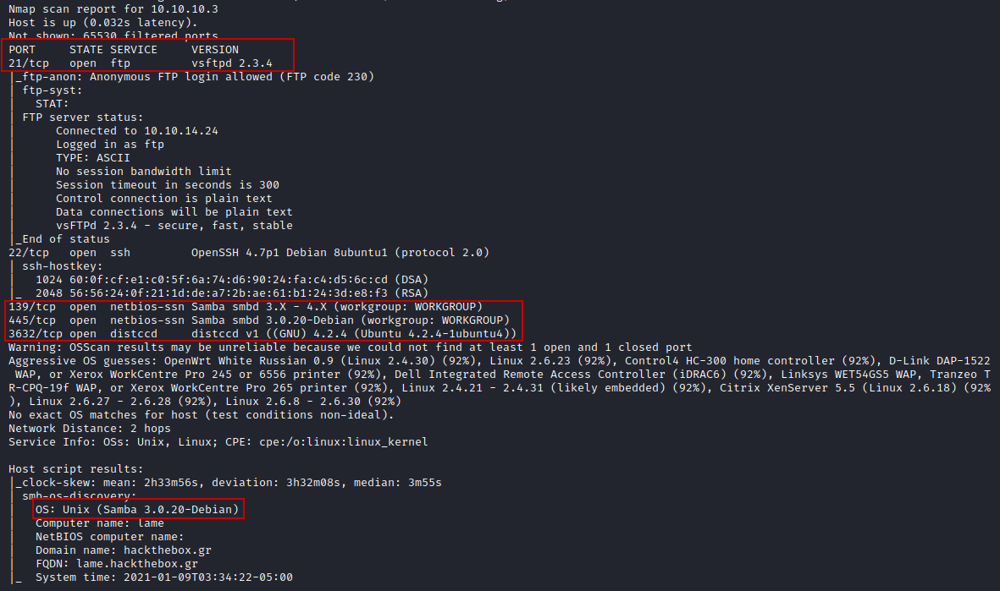
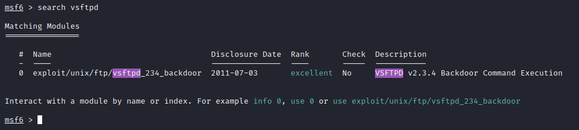
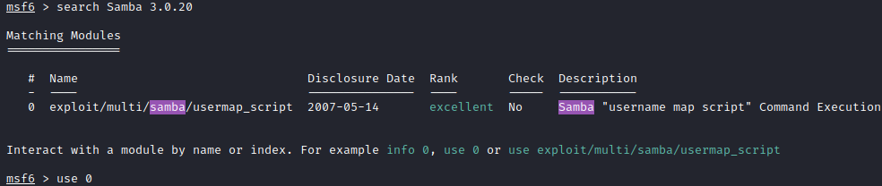
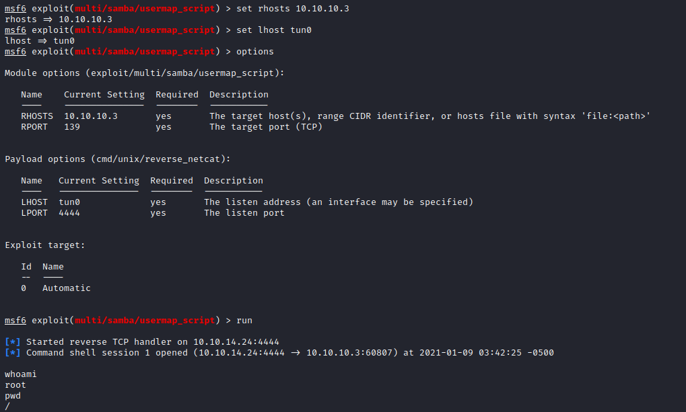

##### Nmap Scan against Lame Machine on 10.10.10.3

nmap -A -T4 -p- 10.10.10.3  
Findings: 

 
There are a couple vulnerabilities on this machine. vsFTPd 2.3.4 could be used, as well as Samba 3.0.20.  
 
 
I used the Samba module. First to set are the RHost & LHost options. Targeting is automated. After that run the module. 

And we have a shell with root access. 