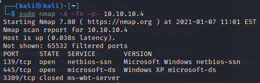
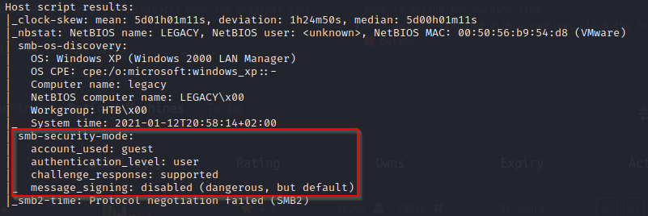
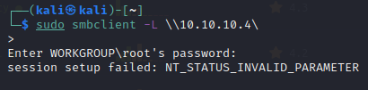
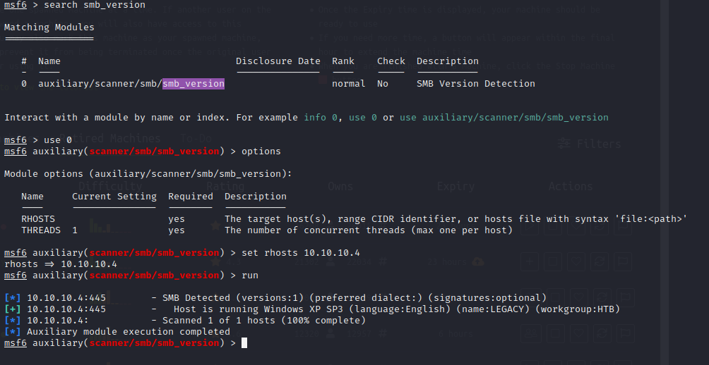
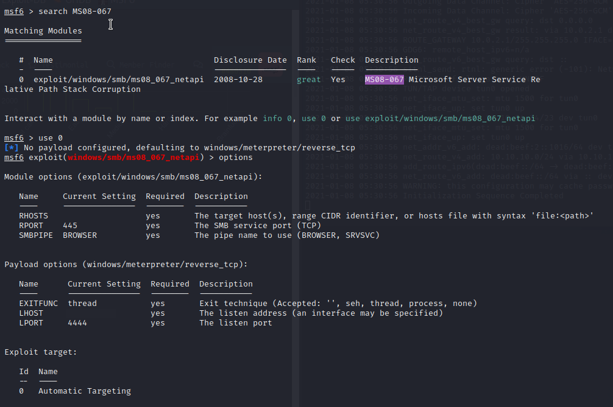
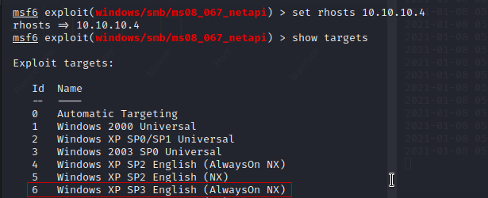
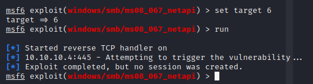
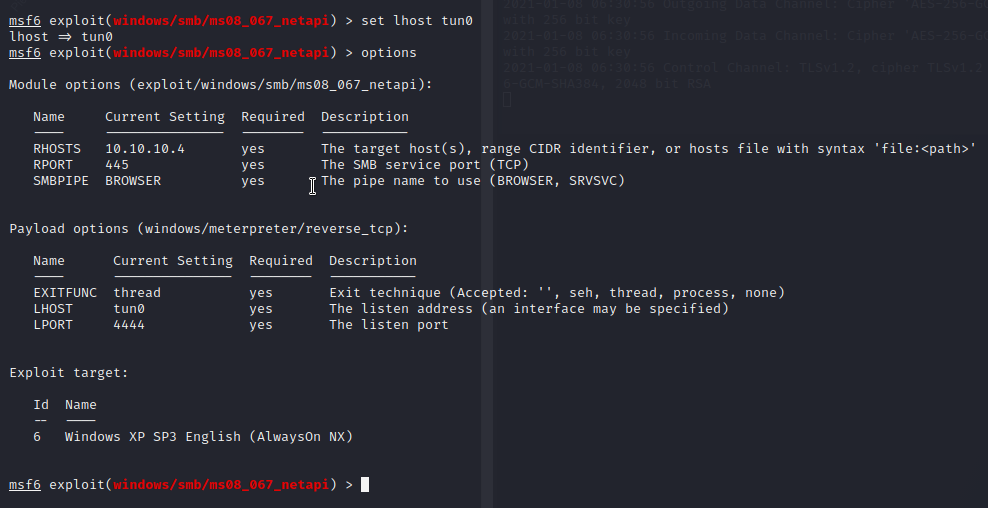
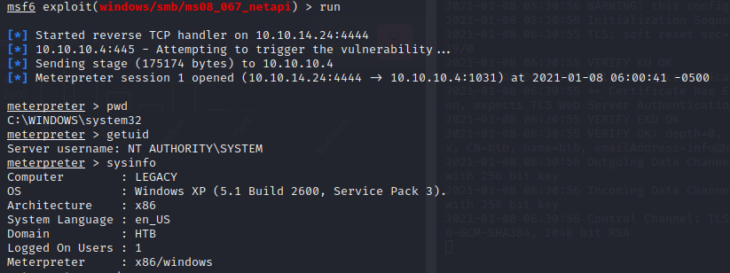

Nmap Scan against Legacy Machine on 10.10.10.4

nmap -A -T4 -p- 10.10.10.4

Findings:   

Open Ports 139 & 445  
On Windows those Ports relate to smb (filesharing).  
Host Script findings:  
Windows XP (Windows 2000 LAN Manager) Definitive OS fingerprint.  
smb-security-mode: message singing disabled. Could lead to a remote shell.  

  
First try to attack: 
Pre installed on kali comes smbclient. I'll try to connect directly to check if it is password protected. In this case, it is. 
  
The next step will be Metasploit. First I use an auxiliary module to scan for the SMB version. This is important, because SMB can be very vulnerable (WannaCry, Eternal Blue).  
Sadly the SMB version doesnt come up, but we can work with the SMB Windows Service Pack version. 
 
After short reconnaissance i have found an exploit on https://www.rapid7.com/db/modules/exploit/windows/smb/ms08_067_netapi/. So i went back to my Metasploit console and searched for the exploit module.  
 
Some options had to be set before the module could be used. 
First the RHost IP, second the target. Metasploit used my VM IP as the LHost Setting, so I didnt change that. Metasploit has an automated Target detection, but I wanted to be sure to set the right one.
 
After setting the Target i ran the first attempt:  
 

I checked my Interface and changed the LHost to the tun0 IP.
 
 
After that i ran the next attempt. This time it worked fine. I had a shell on Legacy.
  